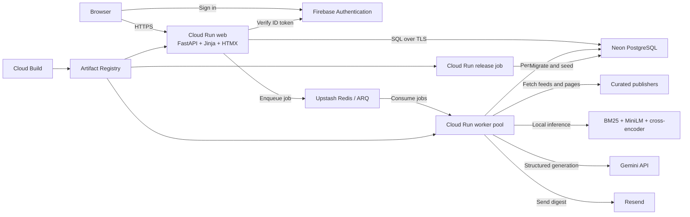
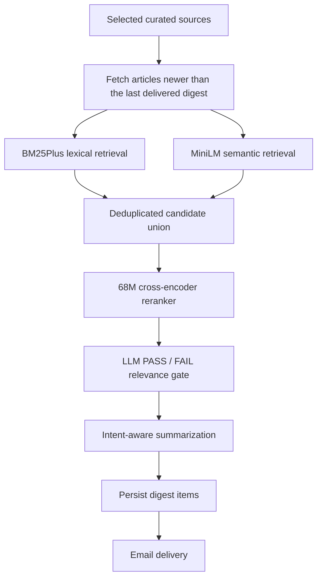
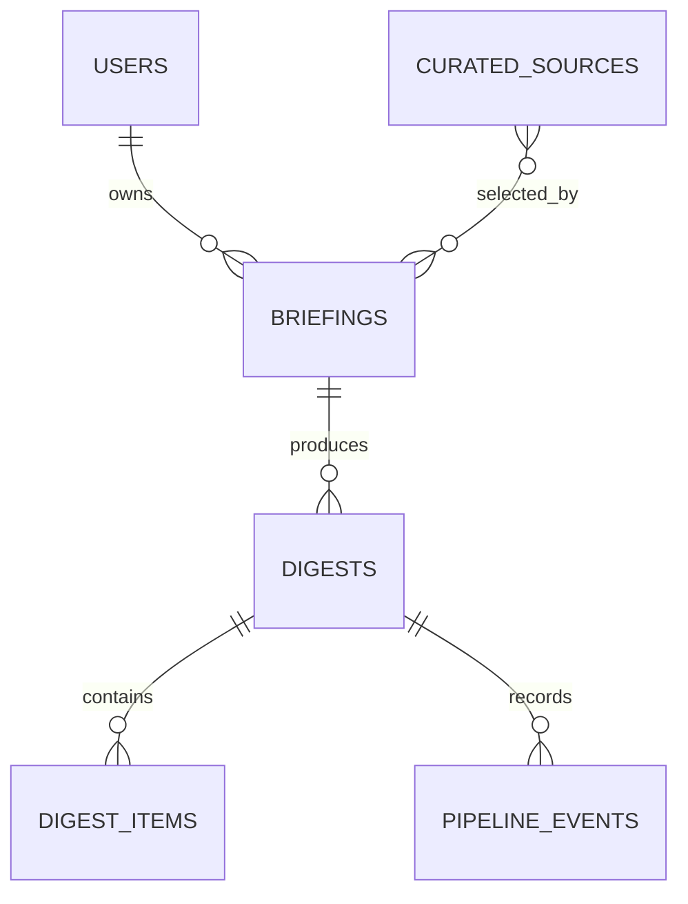

# SmartDigest

SmartDigest is an asynchronous, intent-aware article retrieval and digest-generation system. It collects newly published content from curated sources, narrows the candidate set with local retrieval models, uses an LLM as the final relevance judge, creates contextual summaries, and delivers scheduled email briefings.

The system is designed around a simple constraint: expensive language-model calls should be reserved for articles that have already survived fast, recall-oriented retrieval and reranking.

## Index

- [System Architecture](#system-architecture)
- [AI Pipeline Architecture](#ai-pipeline-architecture)
  - [Pipeline Contract](#pipeline-contract)
  - [1. Intent Construction](#1-intent-construction)
  - [2. Time-Windowed Fetching](#2-time-windowed-fetching)
  - [3. Publication-Date Resolution](#3-publication-date-resolution)
  - [4. Hybrid Candidate Retrieval](#4-hybrid-candidate-retrieval)
  - [5. Candidate Union and Deduplication](#5-candidate-union-and-deduplication)
  - [6. Cross-Encoder Reranking](#6-cross-encoder-reranking)
  - [7. LLM Relevance Gate](#7-llm-relevance-gate)
  - [8. Intent-Aware Summarization](#8-intent-aware-summarization)
  - [9. Persistence and Delivery](#9-persistence-and-delivery)
- [Latency and Cost Optimization](#latency-and-cost-optimization)
- [Jobs, Scheduling, and Recovery](#jobs-scheduling-and-recovery)
- [Deployment and Infrastructure](#deployment-and-infrastructure)
- [Configuration](#configuration)
- [Data Model](#data-model)
- [Observability and Reliability](#observability-and-reliability)
- [Security Model](#security-model)
- [Local Development](#local-development)
- [Testing and Verification](#testing-and-verification)
- [Known Limitations](#known-limitations)
- [Future Improvements and Roadmap](#future-improvements-and-roadmap)
- [Repository Structure](#repository-structure)

## System Architecture

SmartDigest is a Python application deployed as three role-specific runtimes built from one container image:

- **Web:** FastAPI, Jinja, and HTMX application for authentication, briefing management, history, metrics, and job submission.
- **Worker:** Continuous ARQ worker pool that fetches articles, runs the AI pipeline, persists results, and sends email.
- **Release:** One-shot job that applies Alembic migrations and seeds curated sources.



The web and worker communicate through Redis rather than holding an HTTP request open for a complete digest run. PostgreSQL is the durable source of truth for users, briefings, digests, digest items, and pipeline events.

## AI Pipeline Architecture

The main processing path is:



| Stage | Purpose | Execution | Cost characteristic |
|---|---|---|---|
| Fetch window | Avoid reprocessing previously considered content | Feed/page requests | Network-bound |
| BM25Plus | Find exact terms, phrases, and named concepts | Local CPU | Very low |
| Semantic retrieval | Recover conceptual matches without exact wording | Local MiniLM inference | Low |
| Candidate union | Deduplicate and cap retrieval output | In process | Negligible |
| Cross-encoder | Precisely reorder and prune candidates | Local 68M model | Moderate |
| LLM relevance | Make the final inclusion decision | Gemini API | Paid and latency-sensitive |
| Summarization | Transform every accepted article | Gemini API | Paid and latency-sensitive |

### Pipeline Contract

The pipeline is intentionally recall-oriented before the LLM:

1. Cheap retrieval stages should remove obvious noise without aggressively blocking plausible matches.
2. The cross-encoder should reduce LLM traffic while retaining a minimum candidate floor.
3. The LLM is the final article-selection authority.
4. Summarization is transformation-only: every article accepted by relevance must receive exactly one summary.
5. No-new-content and no-relevant-content runs are normal `skipped` outcomes, not system failures.

### 1. Intent Construction

A briefing contains more than a topic label. SmartDigest builds a shared intent context from:

- topic;
- free-form intent description;
- inclusion keywords;
- exclusion keywords; and
- example articles.

This context is converted into lexical terms for BM25 and a natural-language query for semantic retrieval, reranking, relevance judgment, and summarization. Carrying the same goal through every stage prevents retrieval and generation from optimizing for different interpretations of the briefing.

### 2. Time-Windowed Fetching

Before fetching, the worker finds the most recent successfully delivered digest for the same briefing. Its delivery timestamp becomes the lower publication-time boundary for the next run.

The fetch layer:

- requests content from the briefing's selected sources;
- retains articles published after the last delivered digest;
- applies source and global fetch limits;
- deduplicates repeated URLs; and
- records a quiet window as `skipped` when no new articles exist.

This gives a briefing “new since the last successful delivery” semantics instead of repeatedly sampling the same recent articles.

### 3. Publication-Date Resolution

Feed timestamps are not always complete or reliable. SmartDigest distinguishes publication time from update time and can recover publication metadata from the article page. Stored digest items include date provenance, confidence, resolution status, and candidate timestamps.

Once a previous-delivery boundary exists, unresolved undated articles are not allowed to bypass the time window. This favors predictable digest semantics over repeatedly resurfacing content of unknown age.

### 4. Hybrid Candidate Retrieval

BM25 and semantic retrieval run as complementary candidate generators.

#### BM25Plus lexical retrieval

The lexical stage uses the maintained `rank-bm25` package rather than custom ranking math. Product-specific behavior is limited to tokenization and candidate policy:

- titles are weighted more heavily than body text;
- tags receive additional weight;
- exact phrases and broader query coverage receive small boosts;
- explicit exclusion phrases are removed;
- candidates must have real query-term overlap; and
- a low threshold and dynamic limit preserve recall.

BM25 is especially effective for exact terminology, product names, standards, libraries, and other identifiers that semantic models may blur.

#### MiniLM semantic retrieval

The semantic path uses `sentence-transformers/all-MiniLM-L6-v2`. It embeds the briefing query and article text locally, compares normalized vectors with cosine similarity, applies a minimum score, and keeps the top semantic candidates.

This channel recovers relevant articles that express the requested idea without repeating the user's keywords.

### 5. Candidate Union and Deduplication

Lexical and semantic results are merged by article URL, with a source/title fallback when necessary. An article retrieved by both channels retains both channel labels and receives a small combined-retrieval bonus.

The merged set is sorted by retrieval strength and capped by `RETRIEVAL_UNION_MAX_K` (30 by default). This cap bounds cross-encoder work regardless of the number of fetched articles.

### 6. Cross-Encoder Reranking

The local `cross-encoder/ettin-reranker-68m-v1` model scores the briefing query and each candidate article together. Joint encoding is more precise than independently comparing embedding vectors, so this stage is used after broad retrieval and before the paid LLM call.

Default behavior:

- rerank at most the 30-item retrieval union;
- retain up to `RERANKER_TOP_K=10`;
- always retain at least `RERANKER_MIN_KEEP=5` when available;
- infer in batches of 8; and
- optionally support absolute-score and top-score-drop thresholds.

The minimum-keep floor is deliberate. It allows the ranker to save LLM cost without turning an imperfect local score into an overly aggressive relevance gate.

### 7. LLM Relevance Gate

The LLM is the final selection stage. It receives the reduced, reranked candidate set and evaluates each article independently against the user's complete intent.

Each structured result contains:

- `PASS` or `FAIL`;
- a relevance score from 1 to 10; and
- a concise reason tied to the briefing intent.

Requests are batched, use a low temperature, and require exactly one valid decision for every input index. Missing or malformed decisions fail the stage instead of silently dropping an article. Accepted articles are sorted by their LLM relevance score.

The configured model order is lightweight-first, with a stronger model available as fallback.

### 8. Intent-Aware Summarization

Only `PASS` articles reach summarization. Summaries explain what matters to this specific briefing rather than providing generic article abstracts.

Summarization cannot exclude an article. The response contract requires exactly one non-empty summary per accepted input, and the pipeline rejects incomplete batches. This keeps selection and transformation as separate, auditable responsibilities.

### 9. Persistence and Delivery

Accepted articles and their summaries are persisted as digest items with publication metadata and relevance evidence. The worker then renders and sends the digest through Resend.

A successful send marks the digest `delivered` and establishes the time boundary for the next run. A delivery error marks the run `failed`; it does not advance the content window.

## Latency and Cost Optimization

SmartDigest reduces both local latency and paid model usage through the shape of the funnel:

- **Moving time window:** old articles are rejected before ranking.
- **Local first pass:** BM25, embedding retrieval, and reranking do not incur per-request model API charges.
- **Parallel retrieval channels:** lexical and semantic retrieval cover different failure modes before their results are merged.
- **Bounded candidate sets:** semantic top-K, union top-K, and reranker top-K prevent downstream work from growing with the fetched corpus.
- **Lightweight reranker:** the 68M cross-encoder performs higher-precision scoring before Gemini.
- **Minimum recall floor:** at least five candidates survive reranking when available.
- **Batching:** relevance and summary calls process several articles per request.
- **Input limits:** model text is truncated to configured character budgets.
- **Model caching:** local models are loaded once and reused by the worker process.
- **Build-time packaging:** model weights are baked into the image, eliminating production downloads and reducing startup variability.
- **Offline inference:** Hugging Face network access is disabled in the runtime image.

An illustrative funnel might reduce 200 fetched articles to 30 hybrid candidates, 10 reranked candidates, and 6 LLM-approved articles. Actual counts depend on the sources, time window, briefing intent, and configured thresholds.

## Jobs, Scheduling, and Recovery

ARQ uses Redis as the queue between the web process and worker pool. A digest may be queued manually or by the scheduler.

The worker:

- checks due schedules every 30 minutes;
- checks for recoverable queued jobs every 5 minutes;
- retries jobs with bounded attempts and deferred backoff;
- expires stale queue records;
- enforces a per-process concurrent-job limit; and
- checks digest state to avoid processing an already terminal run.

Current defaults allow two concurrent jobs per worker process. Increasing that number is not automatically faster: semantic and cross-encoder inference share the same CPU and memory.

Digest states are:

| State | Meaning |
|---|---|
| `queued` | Accepted for background processing |
| `processing` | A worker owns the pipeline run |
| `delivered` | Email delivery succeeded |
| `skipped` | No new or relevant content required delivery |
| `failed` | A fetch, model, persistence, or delivery stage failed |

## Deployment and Infrastructure

Production runs in Google Cloud project `smartdigest-500718`, region `us-east1`.

### Cloud Run resources

| Resource | Type | Purpose | Current deployment policy |
|---|---|---|---|
| `smartdigest-web` | Cloud Run service | Public FastAPI application | 1 CPU, 1 GiB, concurrency 20, 0–3 instances |
| `smartdigest-worker` | Cloud Run worker pool | Continuous ARQ consumption and scheduled work | 1 instance, 1 CPU, 4 GiB |
| `smartdigest-release` | Cloud Run job | Migrations and source seeding | 1 task, no parallelism |

Cloud Run services scale in response to HTTP demand. Worker pools are continuous, non-HTTP resources and are configured independently; the current worker pool has a fixed instance count.

### Supporting services

| Service | Responsibility |
|---|---|
| Artifact Registry | Stores versioned Docker images |
| Cloud Build | Builds and pushes the image |
| Secret Manager | Stores runtime credentials and connection strings |
| IAM | Provides separate least-privilege identities by runtime role |
| Cloud Logging | Collects application and deployment logs |
| Neon PostgreSQL | Durable relational state over TLS |
| Upstash Redis | ARQ queue and job state over TLS |
| Firebase Authentication | Browser sign-in and server-side token verification |
| Gemini | Structured relevance and summary generation |
| Resend | Digest email delivery |

### Container image

The multi-stage Python 3.11 `Dockerfile` installs dependencies and downloads the semantic and reranker models in the builder stage. The runtime stage copies the virtual environment, model caches, application, templates, migrations, worker entrypoint, and release scripts into a non-root image.

One image is deployed to all three Cloud Run resources with different commands, service accounts, secrets, environment files, and resource limits.

### Deployment workflow

```bash
./deploy.sh
```

The deployment wrapper validates local and Google Cloud prerequisites, compiles the application, runs the unit tests, and invokes the Google Cloud deployment engine. The engine:

1. enables required APIs;
2. creates missing Artifact Registry and IAM resources;
3. builds or reuses a source-fingerprinted image;
4. deploys and executes the release job;
5. deploys the web service;
6. deploys the worker pool; and
7. verifies the web health endpoint.

Deployment IDs are stored as Cloud resource labels, allowing an interrupted deployment to resume safely. See [SERVICES_AND_DEPLOYMENT.md](SERVICES_AND_DEPLOYMENT.md) for the complete operational reference, secret inventory, live-resource details, route inventory, and recovery commands.

## Configuration

Configuration is loaded from the process environment or a local `.env` file through Pydantic settings. Start from [.env.example](.env.example).

### Retrieval and ranking controls

| Variable | Default | Purpose |
|---|---:|---|
| `SEMANTIC_RETRIEVAL_ENABLED` | `true` | Enable semantic retrieval |
| `SEMANTIC_MODEL_NAME` | `sentence-transformers/all-MiniLM-L6-v2` | Embedding model |
| `SEMANTIC_TOP_K` | `20` | Maximum semantic candidates |
| `SEMANTIC_MIN_SCORE` | `0.2` | Minimum cosine similarity |
| `RETRIEVAL_UNION_MAX_K` | `30` | Maximum merged retrieval candidates |
| `RERANKER_ENABLED` | `true` | Enable cross-encoder reranking |
| `RERANKER_REQUIRED` | `true` | Fail rather than bypass an unavailable reranker |
| `RERANKER_TOP_K` | `10` | Maximum reranked candidates sent to relevance |
| `RERANKER_MIN_KEEP` | `5` | Recall-preserving candidate floor |
| `RERANKER_MIN_SCORE` | unset | Optional absolute score threshold |
| `RERANKER_MAX_SCORE_DROP` | unset | Optional maximum drop from the top score |
| `RERANKER_BATCH_SIZE` | `8` | Local inference batch size |

### LLM and worker controls

| Variable | Default | Purpose |
|---|---:|---|
| `LLM_RELEVANCE_MODELS` | `gemini-2.5-flash-lite,gemini-2.5-flash` | Ordered relevance model fallbacks |
| `LLM_SUMMARY_MODELS` | `gemini-2.5-flash-lite,gemini-2.5-flash` | Ordered summary model fallbacks |
| `LLM_RELEVANCE_BATCH_SIZE` | `10` | Articles per relevance request |
| `LLM_SUMMARY_BATCH_SIZE` | `8` | Articles per summary request |
| `LLM_REQUEST_TIMEOUT_SECONDS` | `45` | Provider request timeout |
| `ARQ_MAX_JOBS` | `2` | Concurrent jobs per worker process |
| `ARQ_JOB_TIMEOUT_SECONDS` | `900` | Pipeline job timeout |
| `ARQ_MAX_TRIES` | `4` | Maximum job attempts |

Production startup validates database and Redis TLS configuration, required role-specific secrets, strong session signing, local-only model loading, and worker concurrency.

## Data Model



- **Users:** Firebase-linked identity and account state.
- **Briefings:** Topic, intent, keywords, exclusions, selected sources, schedule, and delivery address.
- **Curated sources:** Seeded source catalog and scraper metadata.
- **Digests:** One queued, processing, skipped, failed, or delivered pipeline run.
- **Digest items:** Delivered articles, summaries, date provenance, and relevance evidence.
- **Pipeline events:** Stage status, duration, item count, and failure diagnostics.

## Observability and Reliability

Each pipeline stage writes a `PipelineEvent` with its status, duration, item count, and optional error. Production uses structured logs, while the application exposes digest history and pipeline metrics through its web interface and API.

Reliability mechanisms include:

- explicit normal-skip semantics;
- structured LLM response validation;
- complete-output contracts for relevance and summaries;
- bounded retries and deferred retry backoff;
- queued and processing job recovery;
- restartable cloud deployments;
- database and Redis smoke scripts; and
- production configuration validation at startup.

Useful future operational metrics include queue age, stage-level P50/P95 latency, candidates retained per stage, LLM tokens and cost per digest, provider error rate, and delivery success rate.

## Security Model

- Firebase ID tokens are verified server-side before an application session is created.
- Session cookies are signed and production requires a strong `JWT_SECRET`.
- Briefing and digest access is scoped to the authenticated owner.
- Delivery addresses are checked against briefing ownership before pipeline work begins.
- Web, worker, and release resources use separate service accounts and secret access.
- PostgreSQL and production Redis connections require TLS.
- Production model loading is local-only.
- The container runs as a non-root user.
- Article text is treated as untrusted data, not as instructions, in LLM prompts.
- Secret values are excluded from Git, documentation, images, and logs.

## Local Development

### Prerequisites

- Python 3.11
- PostgreSQL
- Redis
- Firebase project credentials for authentication
- Gemini API key for relevance and summaries
- Resend credentials for actual email delivery

### Setup

```bash
python3.11 -m venv .venv
source .venv/bin/activate
pip install -r requirements.txt
cp .env.example .env
python -m alembic upgrade head
python -m app.cli seed_sources
```

Fill the required local values in `.env`, then start the web application and worker in separate terminals:

```bash
source .venv/bin/activate
uvicorn app.main:app --reload --host 0.0.0.0 --port 8000
```

```bash
source .venv/bin/activate
python worker.py
```

Open `http://localhost:8000`.

## Testing and Verification

Run the unit suite:

```bash
.venv/bin/python -m unittest discover -s tests
```

Run focused retrieval and production-readiness checks:

```bash
PYTHONPYCACHEPREFIX=/private/tmp/smartdigest-pycache \
  .venv/bin/python -m unittest tests.test_retrieval_pipeline

.venv/bin/python -m unittest tests.test_production_readiness
```

Additional local checks:

```bash
.venv/bin/python -m compileall app worker.py
.venv/bin/python -m pip check
.venv/bin/python scripts/smoke_db.py
.venv/bin/python scripts/smoke_redis.py
```

Passing local tests verifies application behavior and configuration contracts; it does not replace a managed-service smoke test after deployment.

## Known Limitations

- Scheduling currently supports the application's daily schedule model rather than a general-purpose scheduler.
- The worker pool uses a fixed instance count rather than demand-based autoscaling.
- Retrieval K values and score thresholds are configuration-driven but not yet tuned against a labeled evaluation corpus.
- Local CPU inference can become the throughput bottleneck as worker concurrency rises.
- The repository does not yet define a CI pipeline, staging environment, or canary image-promotion workflow.
- Feed quality and publication metadata vary by publisher.
- Digest completion depends on external LLM, email, database, and Redis availability and quotas.

## Future Improvements and Roadmap

### Retrieval evaluation and parameter tuning

Build a versioned, labeled corpus of briefing/article pairs and measure the full funnel rather than tuning one stage in isolation. Candidate parameters include:

- lexical threshold and BM25 candidate limit;
- `SEMANTIC_TOP_K` and `SEMANTIC_MIN_SCORE`;
- `RETRIEVAL_UNION_MAX_K`;
- `RERANKER_TOP_K` and `RERANKER_MIN_KEEP`;
- `RERANKER_MIN_SCORE`; and
- `RERANKER_MAX_SCORE_DROP`.

Track Recall@K, Precision@K, NDCG, false-negative rate, LLM pass rate, latency, cost per digest, and cost per delivered article. These controls interact: increasing an upstream K may improve recall while increasing reranker latency and LLM spend.

Adaptive K values are a promising next step. Small or high-confidence candidate sets do not need the same limits as large, ambiguous sets. Score distribution, corpus size, source count, and agreement between lexical and semantic channels can all inform the budget for the next stage.

### Higher user volume and concurrency

A safe scaling path is:

1. Load-test the current one-instance worker and record CPU, memory, queue age, and provider latency.
2. Increase the worker-pool instance count before aggressively increasing per-process concurrency.
3. Tune `ARQ_MAX_JOBS` against CPU-bound model contention and memory use.
4. Separate schedule scanning from digest execution so scheduler work has one owner.
5. Partition queues by priority or workload and add per-user enqueue limits.
6. Add queue-age-based worker scaling through external metrics and deployment automation.
7. Enforce database connection budgets per instance and validate Redis throughput limits.
8. Apply global LLM concurrency limits, quota tracking, and backpressure.
9. Run burst, soak, retry-storm, and provider-degradation tests before raising production limits.

Simply increasing `ARQ_MAX_JOBS` can reduce throughput when several jobs compete for one CPU and the same local models. Horizontal worker scaling, bounded per-process concurrency, and database/provider budgets must be tuned together.

### Model and retrieval efficiency

- Cache or persist article embeddings across briefings.
- Precompute embeddings during source ingestion.
- Deduplicate syndicated articles across sources.
- Persist per-source crawl state and conditional request metadata.
- Evaluate model quantization or compiled inference.
- Benchmark smaller rerankers against the current 68M model.
- Introduce early stopping when reranker score separation is decisive.
- Cache relevance decisions for identical article-intent pairs.
- Route simple, high-confidence cases through cheaper model paths.

### LLM reliability and cost controls

- Record tokens, latency, model choice, retries, and estimated cost per call.
- Add adaptive batch sizing based on input length.
- Introduce provider circuit breakers and retry classification.
- Enforce per-user and system-wide generation budgets.
- Evaluate model upgrades offline before changing production routing.
- Alert on structured-output errors and abnormal relevance pass rates.

### Deployment maturity

- Add continuous integration for tests, migrations, and image builds.
- Create an isolated staging environment.
- Promote immutable images rather than rebuilding per environment.
- Add canary rollout, automated smoke gates, and rollback.
- Manage infrastructure through versioned infrastructure-as-code.
- Alert on queue age, failed stages, exhausted retries, and email failures.

## Repository Structure

```text
SmartDigest/
├── app/
│   ├── api/                 # HTTP and page endpoints
│   ├── middleware/          # Authentication and rate limiting
│   ├── models/              # SQLAlchemy models
│   ├── schemas/             # Request and response validation
│   ├── services/
│   │   ├── filters/         # BM25, semantic retrieval, reranker, LLM gate
│   │   ├── llm/             # Provider-independent generation layer
│   │   ├── scrapers/        # RSS, Hacker News, and source-specific fetchers
│   │   ├── scheduler.py     # Pipeline orchestration and scheduled enqueueing
│   │   └── summariser.py    # Intent-aware summary generation
│   ├── config.py            # Environment contract and production validation
│   ├── database.py          # Async SQLAlchemy setup
│   └── main.py              # FastAPI entrypoint
├── alembic/                 # Database migrations
├── deploy/                  # Role-specific Cloud Run environment files
├── scripts/                 # Deployment, model, secret, and smoke utilities
├── templates/               # Jinja and HTMX user interface
├── tests/                   # Retrieval and production-readiness tests
├── Dockerfile               # Shared production image
├── worker.py                # ARQ worker entrypoint
├── deploy.sh                # Validated deployment wrapper
└── SERVICES_AND_DEPLOYMENT.md
```

## Operational Reference

For exact service names, live deployment state, secrets by runtime role, endpoints, deployment recovery, and verification procedures, read [SERVICES_AND_DEPLOYMENT.md](SERVICES_AND_DEPLOYMENT.md).
