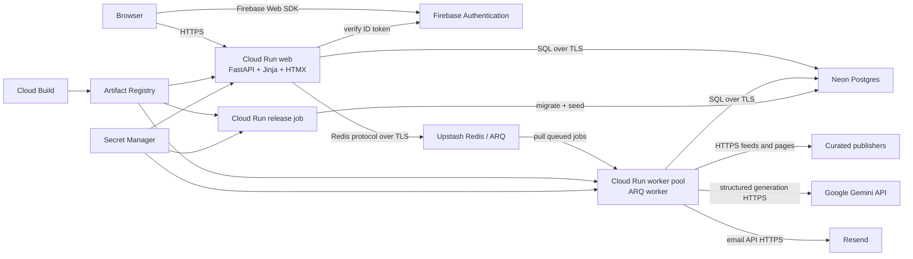

# SmartDigest Services, Architecture, Endpoints, and Deployment

Last verified: 2026-06-30

This is the canonical technical and operational reference for SmartDigest. It
describes the current repository, the live Google Cloud deployment, every
external service the application uses, the application routes, the runtime
data flows, the environment contract, and the known differences between the
repository and the deployed revisions.

Secret values are intentionally omitted. Hostnames, resource names, project
IDs, route paths, and public Firebase identifiers are not credentials.

## 1. System Summary

SmartDigest is one Python application deployed as three separate Google Cloud
Run resources:

1. `smartdigest-web` is the public FastAPI/Jinja/HTMX web application.
2. `smartdigest-worker` is a private, continuously running ARQ worker pool.
3. `smartdigest-release` is an on-demand job for Alembic migrations and source
   seeding.

All three are built from one multi-stage `Dockerfile`. The web and worker share
Neon Postgres and Upstash Redis, but they have separate service accounts,
secrets, resource limits, commands, and scaling behavior.



Google documents Cloud Run services, jobs, and worker pools as separate
resource types. Services handle HTTP, jobs run to completion, and worker pools
run continuous non-HTTP workloads. Worker pools do not have a public URL or
automatic request-based scaling. See the [Cloud Run resource overview](https://docs.cloud.google.com/run/docs/overview/what-is-cloud-run).

## 2. Live Google Cloud Deployment

The following state was read from Google Cloud on 2026-06-30.

| Item | Current value |
|---|---|
| Google Cloud project | `smartdigest-500718` |
| Region | `us-east1` |
| Artifact Registry repository | `us-east1-docker.pkg.dev/smartdigest-500718/smartdigest` |
| Repository format | Docker |
| Public web URL | `https://smartdigest-web-vpcp6fskwa-ue.a.run.app` |
| Custom domain | None confirmed |
| Public IAM | `allUsers` has `roles/run.invoker` on `smartdigest-web` |

### 2.1 Web service

| Setting | Live value |
|---|---|
| Resource | Cloud Run service `smartdigest-web` |
| Revision | `smartdigest-web-00001-hrr` |
| Image | `us-east1-docker.pkg.dev/smartdigest-500718/smartdigest/smartdigest:20260629-104442` |
| Service account | `smartdigest-web@smartdigest-500718.iam.gserviceaccount.com` |
| CPU / memory | 1 CPU / 1 GiB |
| Container concurrency | 20 requests |
| Request timeout | 300 seconds |
| Scaling in deployment script | 0 minimum, 3 maximum instances |
| Entrypoint | Docker default: Uvicorn serving `app.main:app` on `$PORT` |
| Network exposure | Public HTTPS |

The current repository defines `GET /healthz`, but the live web revision does
not contain that route. Live checks on 2026-06-30 returned:

| Probe | Result |
|---|---|
| `GET /` | `200 text/html` |
| `GET /login` | `200 text/html` |
| `GET /healthz` | `404 text/html` |

This is deployment drift: the web service is running an older image than the
current repository. A fresh deployment from the current tree should make
`/healthz` return plain-text `200 ok`.

### 2.2 Worker pool

| Setting | Live value |
|---|---|
| Resource | Cloud Run worker pool `smartdigest-worker` |
| Revision | `smartdigest-worker-00003-gkk` |
| Status | Ready |
| Image | `us-east1-docker.pkg.dev/smartdigest-500718/smartdigest/smartdigest:20260629-1200-full-retrieval-json` |
| Service account | `smartdigest-worker@smartdigest-500718.iam.gserviceaccount.com` |
| CPU / memory | 1 CPU / 4 GiB |
| Instances | 1 |
| Command | `python worker.py` |
| Network exposure | No public HTTP endpoint |

The worker image is newer than the web image. The deployment script is
designed to deploy one newly built image to all three resources, so a normal
full deployment reconciles this image drift.

### 2.3 Release job

| Setting | Live value |
|---|---|
| Resource | Cloud Run job `smartdigest-release` |
| Image | `us-east1-docker.pkg.dev/smartdigest-500718/smartdigest/smartdigest:20260629-104442` |
| Service account | `smartdigest-release@smartdigest-500718.iam.gserviceaccount.com` |
| Command | `sh scripts/run_release_tasks.sh` |
| Tasks / parallelism | 1 / 1 |
| Retries / timeout in script | 0 retries / 15 minutes |
| Latest observed execution | Succeeded on 2026-06-29 |

The release script runs, in order:

```text
python -m alembic upgrade head
python -m app.cli seed_sources
```

### 2.4 Image build

`Dockerfile` uses Python 3.11 and two stages:

1. The builder creates `/opt/venv`, installs `requirements.txt`, downloads the
   semantic and reranker models, and runs `pip check`.
2. The runtime stage copies the virtual environment, model caches, application,
   templates, migrations, worker entrypoint, and release scripts into a
   non-root image.

The models baked into the image are:

| Stage | Model |
|---|---|
| Semantic retrieval | `sentence-transformers/all-MiniLM-L6-v2` |
| Cross-encoder reranking | `cross-encoder/ettin-reranker-68m-v1` |

Runtime model downloads are disabled with `HF_HUB_OFFLINE=1` and
`TRANSFORMERS_OFFLINE=1`. Model files live under `/opt/models`.

## 3. Deployment Procedure

The canonical deploy command is:

```bash
bash scripts/deploy_gcloud.sh smartdigest-500718 us-east1
```

The script performs these operations:

1. Enables the Cloud Run, Artifact Registry, Cloud Build, IAM, and Secret
   Manager APIs.
2. Creates the regional Docker Artifact Registry repository if missing.
3. Creates separate web, worker, and release service accounts if missing.
4. Grants each service account access only to the secrets its role uses.
5. Builds one timestamp-tagged image with Cloud Build.
6. Deploys and executes the release job.
7. Deploys the public web service.
8. Deploys one continuous worker-pool instance.
9. Reads and prints the web URL and expected health URL.

The script defaults can be overridden with these shell variables:

| Variable | Default |
|---|---|
| `SECRET_VERSION` | `1` |
| `ARTIFACT_REPOSITORY` | `smartdigest` |
| `WEB_SERVICE` | `smartdigest-web` |
| `WORKER_POOL` | `smartdigest-worker` |
| `RELEASE_JOB` | `smartdigest-release` |
| `IMAGE_TAG` | Current UTC timestamp |

The deploy is not a traffic-tested canary or an image-promotion pipeline. It
builds and deploys directly. There is no repository CI configuration.

## 4. Google Cloud Services Used

| Service | How SmartDigest uses it | Management endpoint/API |
|---|---|---|
| Cloud Run service | Hosts public FastAPI HTTP traffic | `run.googleapis.com` |
| Cloud Run worker pool | Runs continuous ARQ queue consumption and cron checks | `run.googleapis.com` |
| Cloud Run job | Runs migrations and source seeding to completion | `run.googleapis.com` |
| Artifact Registry | Stores built container images | `artifactregistry.googleapis.com` |
| Cloud Build | Builds and pushes the Docker image | `cloudbuild.googleapis.com` |
| Secret Manager | Stores seven production secrets | `secretmanager.googleapis.com` |
| IAM | Service accounts and per-secret access policies | `iam.googleapis.com` |
| Cloud Logging | Receives container stdout/stderr, including structlog JSON in production | Managed by Cloud Run |

The management APIs are used during deployment, not in normal application
request processing.

## 5. Secret Manager and Runtime Identity

The project currently contains these Secret Manager secret names:

```text
DATABASE_URL
REDIS_URL
JWT_SECRET
FIREBASE_SERVICE_ACCOUNT_JSON
LLM_API_KEY
RESEND_API_KEY
RESEND_FROM_EMAIL
```

No secret value belongs in Git, Markdown, `.env.example`, a Docker layer, or a
chat transcript.

### 5.1 Secret access by role

| Secret | Web | Worker | Release | Purpose |
|---|:---:|:---:|:---:|---|
| `DATABASE_URL` | Yes | Yes | Yes | Neon Postgres connection |
| `REDIS_URL` | Yes | Yes | No | Manual queueing, job status, ARQ worker |
| `JWT_SECRET` | Yes | No | No | Sign and verify `sd_session` cookies |
| `FIREBASE_SERVICE_ACCOUNT_JSON` | Yes | No | No | Firebase Admin ID-token verification |
| `LLM_API_KEY` | No | Yes | No | Gemini relevance and summarization |
| `RESEND_API_KEY` | No | Yes | No | Email delivery |
| `RESEND_FROM_EMAIL` | No | Yes | No | Verified sender identity |

The three runtime identities are:

```text
smartdigest-web@smartdigest-500718.iam.gserviceaccount.com
smartdigest-worker@smartdigest-500718.iam.gserviceaccount.com
smartdigest-release@smartdigest-500718.iam.gserviceaccount.com
```

`scripts/upload_gcloud_secrets.sh` creates missing secret containers, uploads
new versions, maps a local `GEMINI_API_KEY` to the production name
`LLM_API_KEY` when necessary, and generates a persistent 32-byte JWT secret
file if one does not already exist.

## 6. External Application Services

### 6.1 Neon Postgres

| Item | Current value |
|---|---|
| Provider | Neon |
| Host | `ep-proud-poetry-ajc5pujb.c-3.us-east-2.aws.neon.tech` |
| Port | PostgreSQL default `5432` |
| Database | `neondb` |
| Role | `neondb_owner` |
| Connection shape | Direct, not `-pooler` |
| Application driver | SQLAlchemy async engine with asyncpg |
| Transport | TLS requested by asyncpg |

The app accepts `postgres://` or `postgresql://`, normalizes it to
`postgresql+asyncpg://`, removes libpq-style `sslmode`, and passes `ssl=True`
to asyncpg. Alembic uses the same conversion.

The 2026-06-30 live smoke test connected successfully, confirmed Alembic
revision `e5f6a7b8c9d0`, found all six core tables, and found ten curated sources.
`pg_stat_ssl` reported false even though the driver was configured with
`ssl=True`; managed-provider proxies can make that backend observation
misleading. The connection and driver-level TLS configuration both succeeded.

Neon documents direct and pooled connection strings separately; pooled hosts
contain `-pooler`. Direct connections are appropriate for migrations. See
[Neon connection pooling](https://neon.com/docs/connect/connection-pooling).

### 6.2 Upstash Redis

| Item | Current value |
|---|---|
| Provider | Upstash |
| Host | `ready-mastiff-35550.upstash.io` |
| Port | `6379` |
| Scheme | `rediss://` |
| Protocol | Standard Redis protocol over TLS; no Upstash REST SDK |
| Clients | ARQ `RedisSettings`, ARQ pool, and `redis.asyncio` |

Redis serves three purposes:

1. ARQ job queue and job records.
2. Manual and scheduled digest enqueueing.
3. Queue-presence checks for the job-status endpoint.

The 2026-06-30 smoke test confirmed ARQ DSN parsing with TLS, `PING`, and a
short-lived `SET`/`GET` round trip. Upstash states that TLS is always enabled
for its Redis databases; see [Upstash Redis security](https://upstash.com/docs/redis/features/security).

Important keys and conventions:

```text
arq:queue
arq:job:digest:<digest_id>
job ID: digest:<digest_id>
recovery job ID: digest:<digest_id>:recovery
```

### 6.3 Firebase Authentication

| Item | Current value |
|---|---|
| Firebase project | `smartdigest-f50ee` |
| Auth domain | `smartdigest-f50ee.firebaseapp.com` |
| Browser SDK | Firebase JavaScript `12.4.0` |
| Server SDK | Firebase Admin Python `6.5.0` |
| Local app session | Signed HS256 JWT cookie named `sd_session` |
| Session lifetime | 72 hours |

The browser loads these exact modules:

```text
https://www.gstatic.com/firebasejs/12.4.0/firebase-app.js
https://www.gstatic.com/firebasejs/12.4.0/firebase-auth.js
```

Email/password sign-up and login, Google sign-in, password management, account
linking, and token refresh are handled by the Firebase Web SDK. Firebase Auth
uses HTTPS endpoints on:

```text
https://identitytoolkit.googleapis.com/v1/accounts:signUp
https://identitytoolkit.googleapis.com/v1/accounts:signInWithPassword
https://securetoken.googleapis.com/v1/token
```

The Web SDK controls the precise calls and appends the public Firebase Web API
key. See the [Firebase Auth REST reference](https://firebase.google.com/docs/reference/rest/auth/).

After Firebase authenticates the user, the browser sends the Firebase ID token
to SmartDigest:

```text
POST /auth/firebase/session
Content-Type: application/json
{"idToken": "<firebase-id-token>", "name": "<optional-display-name>"}
```

The web service verifies that ID token using Firebase Admin credentials,
creates or updates the local `users` row, then returns the `sd_session`
httpOnly cookie. In production the cookie is `Secure`, `SameSite=Lax`, valid
for three days, and scoped to `/`.

The public Firebase web configuration is sent to the browser and is not an
admin credential. The Firebase service-account JSON is private and comes from
Secret Manager.

### 6.4 Google Gemini API

| Item | Current value |
|---|---|
| SDK | Official `google-genai` Python package |
| Primary model | `gemini-2.5-flash-lite` |
| Fallback model | `gemini-2.5-flash` |
| Response mode | Structured `application/json` with Pydantic schemas |
| Authentication | `LLM_API_KEY`, with local legacy fallback to `GEMINI_API_KEY` |

The SDK calls the Gemini generate-content endpoint:

```text
POST https://generativelanguage.googleapis.com/v1beta/models/<model>:generateContent
```

See Google's [generateContent API reference](https://ai.google.dev/api/generate-content).

Gemini is used twice in each successful digest pipeline:

1. Final article relevance decisions after local retrieval and reranking.
2. Intent-aware summaries for every article that passed final relevance.

Both operations batch articles, request structured JSON, retry retryable
provider errors, and fall back from Flash-Lite to Flash. Provider errors with
HTTP 429, 500, 503, or 504 are considered retryable.

### 6.5 Resend

| Item | Current value |
|---|---|
| SDK | `resend` Python package |
| Base URL | `https://api.resend.com` |
| Send endpoint | `POST https://api.resend.com/emails` |
| Authentication | Bearer API key via the SDK |
| Payload | `from`, one recipient, subject, and generated HTML |

The provider endpoint is documented in the [Resend API introduction](https://resend.com/docs/api-reference/introduction)
and [send-email reference](https://resend.com/docs/api-reference/emails/send-email).

If `RESEND_API_KEY` is absent in development, the mailer logs a preview and
returns success without sending. Production validation requires both
`RESEND_API_KEY` and `RESEND_FROM_EMAIL`.

### 6.6 Publisher feeds and article pages

The release job seeds these ten feed endpoints into `curated_sources`:

| Source | Feed endpoint |
|---|---|
| Hacker News | `https://news.ycombinator.com/rss` |
| TechCrunch | `https://techcrunch.com/feed/` |
| MIT Technology Review | `https://www.technologyreview.com/feed/` |
| The Verge | `https://www.theverge.com/rss/index.xml` |
| Wired | `https://www.wired.com/feed/rss` |
| Ars Technica | `https://feeds.arstechnica.com/arstechnica/index` |
| VentureBeat | `https://venturebeat.com/feed/` |
| InfoQ | `https://www.infoq.com/feed/` |
| Dev.to | `https://dev.to/feed` |
| Simon Willison | `https://simonwillison.net/atom/everything/` |

The worker fetches feeds with `httpx`, parses them with `feedparser`, follows
article links, and may fetch article HTML to recover full text and publication
dates. Article-page hosts are dynamic because they come from feed entries.
Requests use HTTPS where supplied, follow redirects, identify as
`SmartDigest/2.0`, and use timeouts.

### 6.7 Browser-delivered third-party assets

Templates currently load:

| Asset | Endpoint |
|---|---|
| Inter and JetBrains Mono fonts | `https://fonts.googleapis.com/css2?...` |
| HTMX 1.9.12 | `https://unpkg.com/htmx.org@1.9.12` |
| Firebase App SDK 12.4.0 | `https://www.gstatic.com/firebasejs/12.4.0/firebase-app.js` |
| Firebase Auth SDK 12.4.0 | `https://www.gstatic.com/firebasejs/12.4.0/firebase-auth.js` |

These are runtime browser dependencies, not bundled static assets. If a CDN is
unavailable or blocked by a content-security policy, the associated UI feature
can fail.

## 7. Application Runtime Flow

### 7.1 Login and session flow

1. Browser opens `/login` and loads the Firebase Web SDK.
2. Browser authenticates directly with Firebase.
3. Browser obtains a Firebase ID token.
4. Browser posts the ID token to `/auth/firebase/session`.
5. Web verifies the token through Firebase Admin.
6. Web upserts the Firebase-linked local user in Neon.
7. Web signs an app JWT and sets `sd_session`.
8. `SessionAuthMiddleware` verifies the cookie on protected requests and sets
   `request.state.user_id` and `request.state.user_email`.

The SmartDigest session is stateless; it is not stored in Redis.

### 7.2 Manual digest flow

1. Authenticated browser posts to
   `/api/v1/briefings/<briefing_id>/trigger`.
2. Web verifies briefing ownership and delivery-email ownership.
3. Web creates a `digests` row with status `queued`.
4. Web enqueues `run_pipeline` in Upstash with job ID
   `digest:<digest_id>` and a seven-day expiry.
5. Worker pulls the job and changes the digest to `processing`.
6. Worker obtains a Postgres advisory lock so one briefing cannot process twice
   concurrently.
7. Worker calculates the fetch window from the most recent delivered digest.
8. Worker fetches feeds and linked pages concurrently.
9. Worker performs local retrieval and Gemini relevance selection.
10. Worker asks Gemini to summarize every selected article.
11. Worker writes `digest_items` and `pipeline_events` to Neon.
12. Worker sends the HTML digest through Resend.
13. Worker marks the digest `delivered` or `failed`.

### 7.3 Scheduled and recovery flow

The worker has two ARQ cron jobs:

| Function | Check frequency | Behavior |
|---|---|---|
| `enqueue_scheduled_digests` | Every hour and half-hour, plus startup | Compares each active briefing's daily cron schedule and queues a due run |
| `recover_queued_digests` | Every five minutes, plus startup | Requeues stale queued jobs and recovers stale processing jobs |

The worker uses one instance and `ARQ_MAX_JOBS=2`, so at most two jobs run
concurrently in that process.

### 7.4 Retrieval and delivery pipeline

The current pipeline is:

```text
fetch full time window
  -> BM25 lexical retrieval (top 20 by default)
  +  semantic retrieval (top 20)
  -> deduplicated union (maximum 30)
  -> local cross-encoder reranker (top 10, minimum keep 5)
  -> Gemini PASS/FAIL relevance gate
  -> Gemini summarization
  -> Neon persistence
  -> Resend delivery
```

The summarizer is not a selection stage: it must produce exactly one summary
for every article that passed relevance. A mismatch fails the stage.

If a briefing has a prior delivered digest and no newer articles are found,
the run is marked `skipped`, not failed, and no email is sent.

Retryable Gemini failures cause ARQ to retry the pipeline after the configured
defer interval until the maximum attempt count is reached.

## 8. Data Stored in Neon

| Table | Purpose |
|---|---|
| `users` | Local user profile and Firebase UID mapping |
| `curated_sources` | Seeded feed catalog and scraper metadata |
| `briefings` | User intent, keywords, exclusions, sources, schedule, and email |
| `digests` | One queued/processing/delivered/skipped/failed run per briefing |
| `digest_items` | Selected articles, summary, dates, and relevance metadata |
| `pipeline_events` | Stage status, duration, item counts, and error details |
| `alembic_version` | Current schema revision |

The historical `api_keys` table is dropped by migration
`a1b2c3d4e5f6`; API-key authentication is no longer part of the application.

## 9. HTTP Endpoints

### 9.1 Authentication boundary

The middleware allows these paths without a SmartDigest session:

```text
GET  /
GET  /healthz
GET  /login
POST /auth/firebase/session
POST /auth/logout
GET  /api/v1/sources
GET  /docs and documentation assets
GET  /openapi.json
GET  /redoc
```

Every other page or API path requires a valid `sd_session` cookie. Missing or
invalid sessions receive a JSON 401 for `/api/...` paths and a 303 redirect to
`/login` for browser pages.

### 9.2 Authentication API

| Method | Path | Input | Result / services used |
|---|---|---|---|
| POST | `/auth/firebase/session` | JSON `idToken`, optional `name` | Firebase Admin verification, Neon user upsert, sets `sd_session` |
| POST | `/auth/logout` | None | Deletes `sd_session`, redirects to `/?logged_out=1` |

### 9.3 Versioned JSON API

| Method | Path | Purpose | Backends |
|---|---|---|---|
| GET | `/api/v1/sources` | List active curated sources | Neon |
| POST | `/api/v1/briefings` | Create an owned briefing | Neon |
| GET | `/api/v1/briefings` | List active owned briefings | Neon |
| GET | `/api/v1/briefings/{briefing_id}` | Read one owned briefing | Neon |
| PATCH | `/api/v1/briefings/{briefing_id}` | Partially update an owned briefing | Neon |
| DELETE | `/api/v1/briefings/{briefing_id}` | Soft-delete an owned briefing | Neon |
| POST | `/api/v1/briefings/{briefing_id}/trigger` | Create digest and enqueue pipeline; limited to 3/hour per user | Neon, Upstash |
| GET | `/api/v1/digests` | List the user's most recent 50 digests | Neon |
| GET | `/api/v1/digests/{digest_id}` | Get one owned digest and its items | Neon |
| GET | `/api/v1/jobs/{job_id}` | Combine digest state, latest event, and Redis queue presence | Neon, Upstash |
| GET | `/api/v1/metrics/pipeline` | Aggregate 24-hour pipeline metrics | Neon |
| GET | `/api/v1/metrics/usage` | Count current user's briefings and digests | Neon |

Briefing create/update fields are:

```text
topic
intent_description
keywords[]
sources[]
email
schedule
example_articles[]
exclusion_keywords[]
```

Schedules must be daily cron expressions on an `:00` or `:30` boundary. The
delivery email must match the authenticated account email.

### 9.4 HTML and partial routes

| Method | Path | Purpose |
|---|---|---|
| GET | `/healthz` | Plain-text liveness response in current repository |
| GET | `/` | Public marketing page |
| GET | `/login` | Firebase login and registration page |
| GET | `/app` | Main dashboard |
| GET | `/dashboard/metrics` | HTMX dashboard metrics partial |
| GET | `/account/security` | Firebase password and identity-linking UI |
| GET | `/app/briefings` | Briefing list |
| GET | `/app/briefings/{briefing_id}` | Briefing overview, latest email, articles, and history |
| GET | `/app/briefings/{briefing_id}/edit` | Briefing editor |
| GET | `/app/settings` | Account and usage settings |
| GET | `/app/digests` | Digest archive |
| GET | `/app/digests/{digest_id}` | Owned digest detail |
| GET | `/metrics` | Metrics page |
| GET | `/metrics/content` | HTMX metrics content partial |

Backward-compatible aliases currently remain:

```text
/digests                         -> /app/digests handler
/digests/{digest_id}             -> /app/digests/{digest_id} handler
/app/admin/metrics               -> /metrics handler
/app/admin/metrics/content       -> /metrics/content handler
```

### 9.5 FastAPI documentation

FastAPI exposes:

```text
GET /openapi.json
GET /docs
GET /redoc
```

These are currently public because the auth middleware excludes their paths.

## 10. Environment Contract

### 10.1 Core and role settings

| Variable | Default / production source | Meaning |
|---|---|---|
| `ENV` | `development`; deploy YAML sets `production` | Logging and production validation mode |
| `APP_ROLE` | `all`; deploy YAML uses `web`, `worker`, or `release` | Selects role-specific validation |
| `DATABASE_URL` | Local Postgres default; Secret Manager in production | SQLAlchemy/asyncpg connection |
| `REDIS_URL` | Local Redis default; Secret Manager in production | ARQ and Redis connection |
| `ALLOW_INSECURE_PRODUCTION_REDIS` | `false` | Explicit escape hatch for non-TLS production Redis |

### 10.2 Authentication and Firebase settings

| Variable | Default / source | Meaning |
|---|---|---|
| `JWT_SECRET` | Development placeholder; Secret Manager in production | HS256 session signing key |
| `FIREBASE_SERVICE_ACCOUNT_JSON` | Empty; Secret Manager in production | Inline Firebase Admin credential JSON |
| `FIREBASE_SERVICE_ACCOUNT_PATH` | `~/.config/smartdigest/firebase/firebase-admin-service-account.json` | Local Admin credential path fallback |
| `FIREBASE_WEB_API_KEY` | Public value in settings | Browser Firebase configuration |
| `FIREBASE_WEB_AUTH_DOMAIN` | `smartdigest-f50ee.firebaseapp.com` | Browser Firebase configuration |
| `FIREBASE_WEB_PROJECT_ID` | `smartdigest-f50ee` | Browser Firebase configuration |
| `FIREBASE_WEB_STORAGE_BUCKET` | Public value in settings | Browser Firebase configuration |
| `FIREBASE_WEB_MESSAGING_SENDER_ID` | Public value in settings | Browser Firebase configuration |
| `FIREBASE_WEB_APP_ID` | Public value in settings | Browser Firebase configuration |
| `FIREBASE_WEB_MEASUREMENT_ID` | Public value in settings | Optional browser analytics identifier |

### 10.3 Gemini and batching settings

| Variable | Default | Meaning |
|---|---|---|
| `LLM_API_KEY` | Empty | Preferred production Gemini credential |
| `LLM_RELEVANCE_MODELS` | Empty, then adapter defaults | Comma-separated relevance fallback chain |
| `LLM_SUMMARY_MODELS` | Empty, then adapter defaults | Comma-separated summary fallback chain |
| `LLM_REQUEST_TIMEOUT_SECONDS` | `45` | Request timeout |
| `LLM_RETRY_ATTEMPTS` | `2` | Attempts per model |
| `LLM_RETRY_BACKOFF_SECONDS` | `1` | Base retry delay |
| `LLM_RELEVANCE_BATCH_SIZE` | `10` | Articles per relevance request |
| `LLM_RELEVANCE_MAX_OUTPUT_TOKENS` | `4096` | Relevance response cap |
| `LLM_SUMMARY_BATCH_SIZE` | `8` | Articles per summary request |
| `LLM_SUMMARY_ARTICLE_MAX_CHARS` | `1800` | Per-article prompt content cap |

Legacy `GEMINI_*` settings remain as compatibility fallbacks:

| Variable | Default | Meaning |
|---|---|---|
| `GEMINI_API_KEY` | Empty | Local legacy credential fallback |
| `GEMINI_RELEVANCE_MODELS` | `gemini-2.5-flash-lite,gemini-2.5-flash` | Legacy relevance model chain |
| `GEMINI_SUMMARY_MODELS` | `gemini-2.5-flash-lite,gemini-2.5-flash` | Legacy summary model chain |
| `GEMINI_REQUEST_TIMEOUT_SECONDS` | `45` | Legacy request timeout |
| `GEMINI_RETRY_ATTEMPTS` | `2` | Legacy attempts per model |
| `GEMINI_RETRY_BACKOFF_SECONDS` | `1` | Legacy base retry delay |
| `GEMINI_SUMMARY_BATCH_SIZE` | `8` | Legacy summary batch size |
| `GEMINI_SUMMARY_ARTICLE_MAX_CHARS` | `1800` | Legacy per-article prompt cap |

New production configuration should use the `LLM_*` names.

### 10.4 Semantic retrieval settings

| Variable | Default | Meaning |
|---|---|---|
| `HF_HOME` | `/opt/models/huggingface` | Hugging Face cache root |
| `TRANSFORMERS_CACHE` | `/opt/models/huggingface/transformers` | Transformers cache |
| `SENTENCE_TRANSFORMERS_HOME` | `/opt/models/sentence-transformers` | Sentence Transformers cache |
| `SEMANTIC_RETRIEVAL_ENABLED` | `true` | Enable semantic retrieval |
| `SEMANTIC_WARMUP_ENABLED` | `false` | Compatibility flag; worker explicitly preloads in production |
| `SEMANTIC_MODEL_LOCAL_FILES_ONLY` | `true` | Prohibit runtime downloads |
| `SEMANTIC_MODEL_LOAD_TIMEOUT_SECONDS` | `5` locally; worker YAML sets `120` | Model load timeout |
| `SEMANTIC_MODEL_NAME` | `sentence-transformers/all-MiniLM-L6-v2` | Embedding model |
| `SEMANTIC_TOP_K` | `20` | Semantic candidate count |
| `SEMANTIC_MIN_SCORE` | `0.2` | Minimum cosine similarity |
| `SEMANTIC_QUERY_MAX_CHARS` | `2000` | Query text cap |
| `SEMANTIC_ARTICLE_MAX_CHARS` | `1800` | Article text cap |
| `RETRIEVAL_UNION_MAX_K` | `30` | BM25/semantic merged cap |

### 10.5 Reranker settings

| Variable | Default | Meaning |
|---|---|---|
| `RERANKER_ENABLED` | `true` | Enable cross-encoder reranking |
| `RERANKER_REQUIRED` | `true` | Fail instead of silently bypassing model-load failure |
| `RERANKER_WARMUP_ENABLED` | `false` | Compatibility flag; worker explicitly preloads in production |
| `RERANKER_MODEL_LOCAL_FILES_ONLY` | `true` | Prohibit runtime downloads |
| `RERANKER_MODEL_LOAD_TIMEOUT_SECONDS` | `45` locally; worker YAML sets `120` | Model load timeout |
| `RERANKER_MODEL_NAME` | `cross-encoder/ettin-reranker-68m-v1` | Cross-encoder model |
| `RERANKER_TOP_K` | `10` | Maximum articles sent to final relevance |
| `RERANKER_MIN_KEEP` | `5` | Recall floor when enough articles exist |
| `RERANKER_MIN_SCORE` | `null` | Optional absolute cutoff |
| `RERANKER_MAX_SCORE_DROP` | `null` | Optional cutoff relative to top score |
| `RERANKER_ARTICLE_MAX_CHARS` | `1800` | Article text cap |
| `RERANKER_BATCH_SIZE` | `8` | Model inference batch size |

### 10.6 Queue and recovery settings

| Variable | Default | Meaning |
|---|---|---|
| `ARQ_JOB_EXPIRES_SECONDS` | `604800` | Queue job expiry, seven days |
| `ARQ_JOB_TIMEOUT_SECONDS` | `900` | Worker timeout, fifteen minutes |
| `ARQ_MAX_TRIES` | `4` | Maximum ARQ attempts |
| `ARQ_MAX_JOBS` | `2` | Per-worker concurrency |
| `QUEUED_DIGEST_RECOVERY_AFTER_MINUTES` | `5` | Stale queued threshold |
| `PROCESSING_DIGEST_RECOVERY_AFTER_MINUTES` | `30` | Stale processing threshold |
| `PIPELINE_RETRY_DEFER_SECONDS` | `300` | Retry defer, five minutes |

### 10.7 Email settings

| Variable | Default / source | Meaning |
|---|---|---|
| `RESEND_API_KEY` | Empty; Secret Manager in production | Resend credential |
| `RESEND_FROM_EMAIL` | `SmartDigest <digest@smartdigest.app>` | Verified sender |

### 10.8 Production validation

At startup, production settings reject:

- Local or incomplete Postgres URLs.
- Local, malformed, or non-TLS Redis unless explicitly overridden.
- Runtime model downloads for enabled semantic/reranker stages.
- Weak/default JWT secrets on the web role.
- Missing or malformed Firebase Admin JSON on the web role.
- Missing Gemini or Resend configuration on the worker role.
- Worker concurrency below one.

## 11. Non-secret Deployment YAML

`deploy/web.env.yaml` sets:

```text
ENV=production
APP_ROLE=web
SEMANTIC_RETRIEVAL_ENABLED=false
RERANKER_ENABLED=false
```

The web process does not run retrieval, so model stages are disabled there.

`deploy/worker.env.yaml` sets production worker role, two-job concurrency,
Gemini model fallback chains and batching, semantic and reranker enablement,
required reranking, and 120-second model-load timeouts.

`deploy/release.env.yaml` sets only:

```text
ENV=production
APP_ROLE=release
```

## 12. Local Development and Verification

Local defaults expect Postgres on `localhost:5432` and Redis on
`localhost:6379`. Put real credentials in the untracked `.env`, never in
`.env.example`.

Common commands:

```bash
# Run the web app
.venv/bin/uvicorn app.main:app --reload

# Run the ARQ worker
.venv/bin/python worker.py

# Apply migrations
.venv/bin/python -m alembic upgrade head

# Seed sources
.venv/bin/python -m app.cli seed_sources

# Run the focused test suite
env PYTHONPYCACHEPREFIX=/private/tmp/smartdigest-pycache \
  .venv/bin/python -m unittest \
  tests.test_retrieval_pipeline tests.test_production_readiness

# Verify Neon and schema
.venv/bin/python scripts/smoke_db.py --check-tables

# Verify Upstash Redis protocol access
.venv/bin/python scripts/smoke_redis.py
```

Verification on 2026-06-30:

| Check | Result |
|---|---|
| Application module imports | Passed |
| Python compilation | Passed |
| Unit/targeted integration tests | 64 passed |
| Neon connection and schema smoke | Passed |
| Upstash TLS `PING` and round trip | Passed |
| Live web `/` | 200 |
| Live web `/login` | 200 |
| Live web `/healthz` | 404; deployed revision drift |

## 13. Observability

Production logging is newline-delimited JSON through structlog. Cloud Run
captures stdout/stderr in Cloud Logging.

Application observability also lives in `pipeline_events`, with:

```text
digest_id
stage
status
duration_ms
error_msg
item_count
created_at
```

Tracked stages are `fetch`, `filter`, `summarise`, and `deliver`. The UI and API
aggregate these rows for metrics. There are no repository-defined Cloud
Monitoring alert policies, queue-depth alerts, SLOs, or distributed traces.

## 14. Known Deployment and Security Gaps

These are current facts, not deleted historical audit notes:

1. The live web service is behind the repository and returns 404 for
   `/healthz`; web, worker, and release do not currently share one image tag.
2. Briefing source URLs are accepted from the API without a strict curated
   allowlist or private-network/redirect protection, creating an SSRF boundary
   that must be hardened before accepting untrusted source URLs.
3. `/api/v1/jobs/{job_id}` reads a digest by ID without joining through the
   authenticated user's briefing ownership.
4. `/api/v1/metrics/pipeline` returns global pipeline metrics and recent error
   details to any authenticated user.
5. Cookie-authenticated state-changing routes do not implement explicit CSRF
   tokens or Origin/Referer enforcement.
6. Feed, user, and model-controlled values need one consistent HTML-escaping and
   URL-validation boundary before email HTML is considered safe for untrusted
   content.
7. FastAPI docs are publicly reachable.
8. The repository has no CI workflow, dependency-update automation, deployment
   promotion pipeline, alert policy, backup/restore runbook, or formal data
   retention/deletion policy.
9. Browser runtime behavior depends on third-party CDNs for HTMX, Firebase JS,
   and fonts.

The current deployment is suitable for controlled use and engineering
validation. Resolve the authorization, SSRF, CSRF, and escaping boundaries
before treating it as ready for arbitrary public users.

## 15. Reconciliation Checklist

Before the next release:

1. Review the dirty working tree and commit the intended code and cleanup.
2. Run the 64-test suite and both managed-service smoke scripts.
3. Run the full deployment script from the repository root.
4. Confirm the web, worker, and release resources reference the same new image
   tag or digest.
5. Confirm `GET <web-url>/healthz` returns `200 ok`.
6. Confirm the worker revision is Ready and its startup logs show both local
   models loaded.
7. Trigger one controlled briefing and inspect `digests`, `digest_items`, and
   `pipeline_events` through delivery.
8. Confirm Resend accepted the message and the expected account received it.
9. Add the deployed hostname or custom domain to Firebase Authentication's
   authorized domains.
10. Preserve rollback information: previous image digest, previous Cloud Run
    revisions, database migration revision, and operator timestamp.
